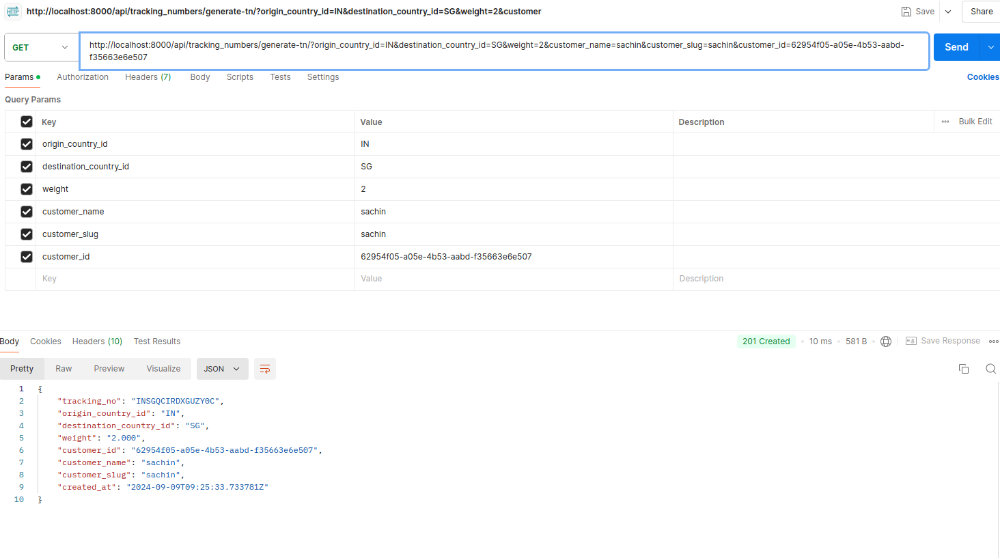

# Tracking Number Generator API

This project implements a RESTful API using Django REST Framework to generate unique tracking numbers for parcels. The API ensures the generated tracking numbers follow a specified format, are unique, and can handle high concurrency and scalability.

## Features

- Generates unique tracking numbers that match the regex pattern `^[A-Z0-9]{1,16}$`
- Ensures no duplicate tracking numbers are generated. Our system will try to generate a unique tracking number 10 times and if it cannot, it will cancel. This means that, we need to generate tracking number in such a way that it will be unique with 1 or 2 attempts.
- Validates input fields using Django Rest Framework serializers
- API optimized for scalability and high concurrency

## Requirements

- Python 3.x
- Django 3.x or later
- Django REST Framework 3.x or later

## Setup

### 1. Clone the repository:

```bash
git clone git@github.com:bhaskar8088/generate-tracking-number.git

# Create a new virtual environment

python -m venv venv
source venv/bin/activate

cd generate_tn_django

### Virtualenv


# Install requirements

pip install -r requirements.txt

# Run migrations
python manage.py migrate

# Run server
python manage.py runserver

```

## How to test

GET http://localhost:8000/api/tracking_numbers/generate-tn/ in postman with the below query params:

```bash
origin_country_id
destination_country_id
weight
customer_name
customer_slug

# Below is an example

origin_country_id=IN
destination_country_id=SG
weight=2
customer_name=sachin
customer_slug=sachin

```

### Below is the postman screenshot:



### Public URL

Currently, its deployed to EC2

Here is the url:

http://3.93.175.178/api/tracking_numbers/generate-tn